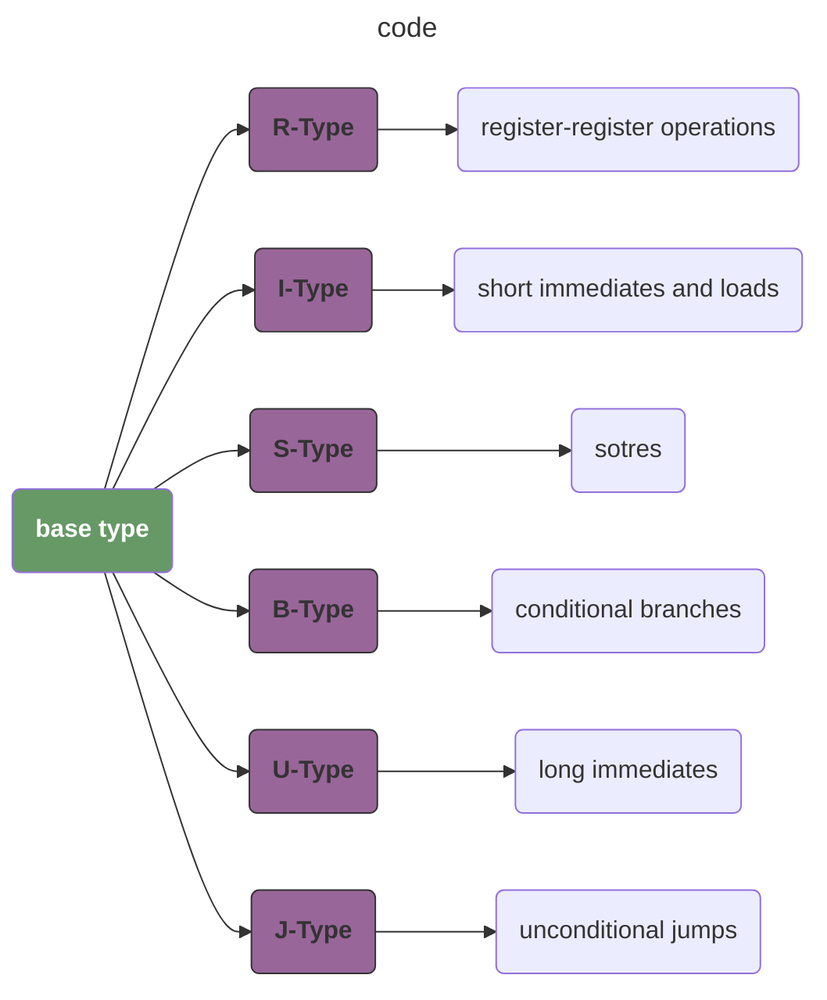
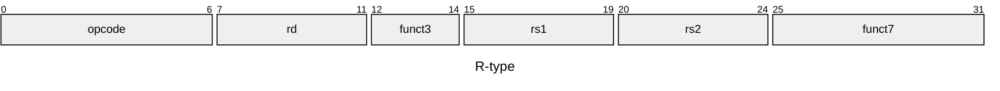

# tiny-RISC-V
Recording the learning process of RISC-V

## REFERENCE

- [box-256](http://box-256.com/)
- [一个学习汇编的小游戏：BOX-256](https://0x822a5b87.github.io/2025/03/18/%E4%B8%80%E4%B8%AA%E5%AD%A6%E4%B9%A0%E6%B1%87%E7%BC%96%E7%9A%84%E5%B0%8F%E6%B8%B8%E6%88%8F%EF%BC%9ABOX-256/)

## REPRESENTATION

### BASE REPRESENTATION

$\underline{s}et~\underline{l}ess~\underline{t}han\Biggl\{\underline{\overline{i}}mmediate\Biggl\}\Biggl\{\underline{\overline{u}}nsigned\Biggl\}$, this represents four different instructions: `slt`, `slti`, `sltu`, `sltiu`.

### TYPE

### RISC-V instruction formats

