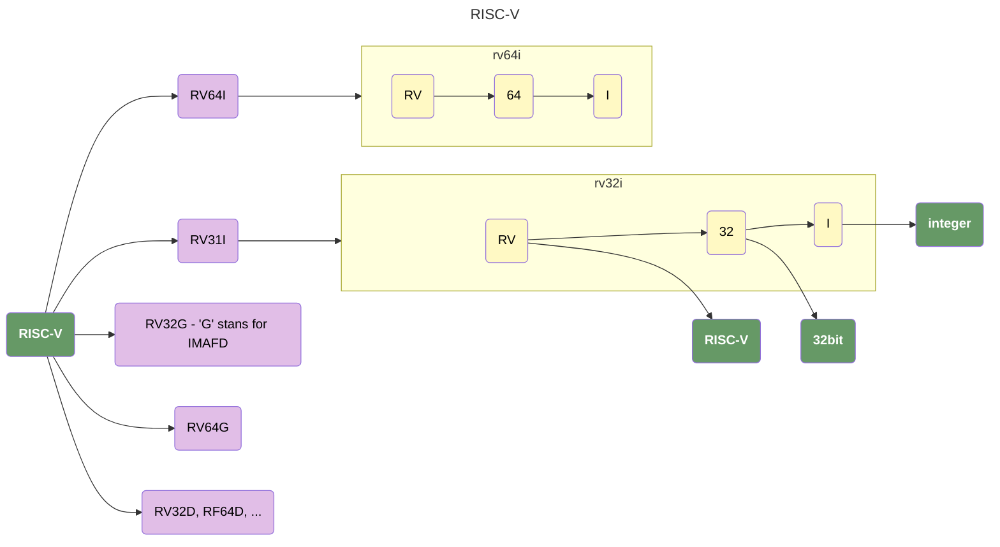
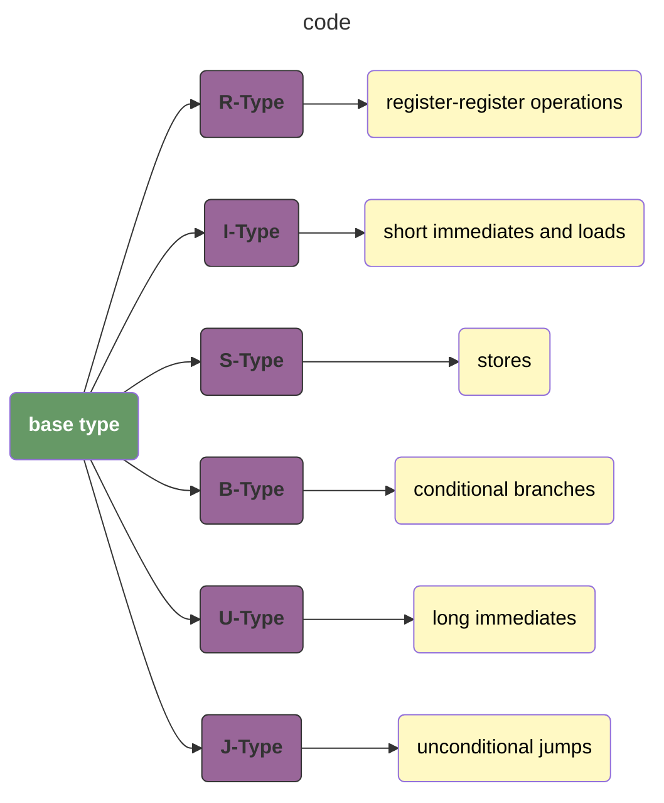
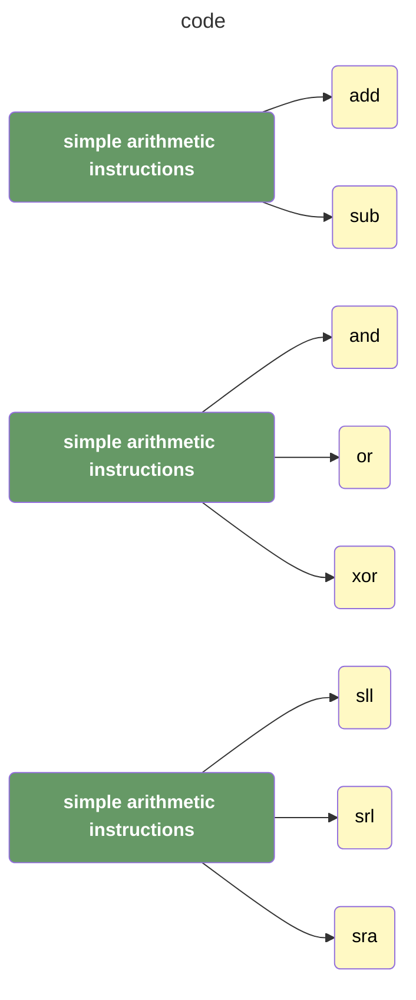
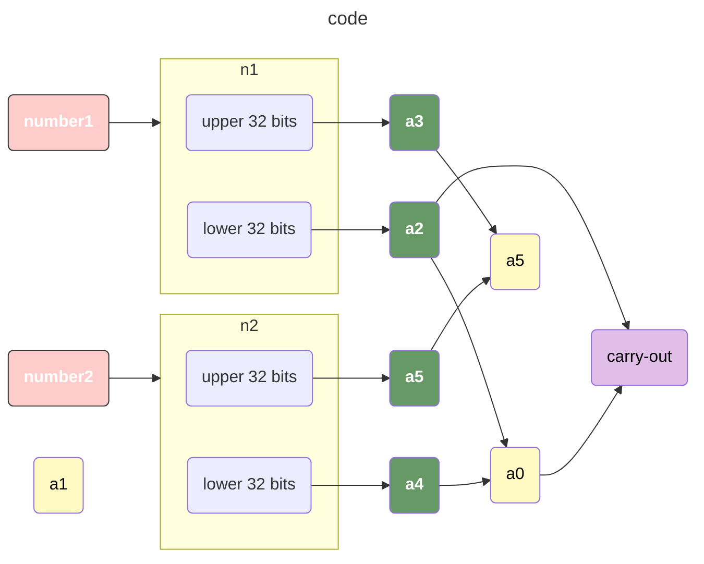
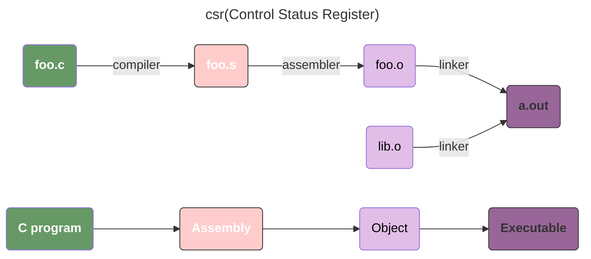

# tiny-RISC-V
Recording the learning process of RISC-V

## REFERENCE

- [box-256](http://box-256.com/)
- [一个学习汇编的小游戏：BOX-256](https://0x822a5b87.github.io/2025/03/18/%E4%B8%80%E4%B8%AA%E5%AD%A6%E4%B9%A0%E6%B1%87%E7%BC%96%E7%9A%84%E5%B0%8F%E6%B8%B8%E6%88%8F%EF%BC%9ABOX-256/)
- 《RISC-V体系结构：编程与实践》

## EXTENSION




## REPRESENTATION

### BASE REPRESENTATION

$\underline{s}et~\underline{l}ess~\underline{t}han\{\underline{\overline{i}}mmediate\}\{\underline{\overline{u}}nsigned\}$, this represents four different instructions: `slt`, `slti`, `sltu`, `sltiu`.

### TYPE



### OTHER TYPES



### RISC-V instruction formats

|    code     | desc                            |
| :---------: | ------------------------------- |
|  `opcode`   | `O`peration `C`ode              |
|    `rd`     | `D`estination`R`egister         |
|  `funct3`   | `FUNCT`ion with `3` bits        |
|    `rs1`    | `S`ource `R`egister `1`         |
| `imm[12:5]` | `imm`ediate bit `12` to bit `5` |

```mermaid
---
title: RISC-V
config:
    block:
        padding : 10
        font_size : 20
---
block-beta

columns 35
31 30 29 28 27 26 25 24 23 22 21 20 19 18 17 16 15 14 13 12 11 10 9 8 7 6 5 4 3 2 1 0 type["tp"]:3

block:g_1_1:7
    l_1_1("funct7")
end
block:g_1_2:5
    l_1_2("rs2")
end
block:g_1_3:5
    l_1_3("rs1")
end
block:g_1_4:3
    l_1_4("funct3")
end
block:g_1_5:5
    l_1_5("rd")
end
block:g_1_6:7
    l_1_6("opcode")
end
block:g_1_7:3
    l_1_7("R-type")
end

block:g_2_1:12
    l_2_1("[11:0]")
end
block:g_2_2:5
    l_2_2("rs1")
end
block:g_2_3:3
    l_2_3("funct3")
end
block:g_2_4:5
    l_2_4("rd")
end
block:g_2_5:7
    l_2_5("opcode")
end
block:g_2_7:3
    l_2_7("I-type")
end

block:g_3_1:7
    l_3_1("[11:5]")
end
block:g_3_2:5
    l_3_2("rs2")
end
block:g_3_3:5
    l_3_3("rs1")
end
block:g_3_4:3
    l_3_4("funct3")
end
block:g_3_5:5
    l_3_5("[4:0]")
end
block:g_3_6:7
    l_3_6("opcode")
end
block:g_3_7:3
    l_3_7("S-type")
end

block:g_4_1:1
    l_4_1("12")
end
block:g_4_9:6
    l_4_9("[10:5]")
end
block:g_4_2:5
    l_4_2("rs2")
end
block:g_4_3:5
    l_4_3("rs1")
end
block:g_4_4:3
    l_4_4("funct3")
end
block:g_4_5:4
    l_4_5("[4:1]")
end
block:g_4_8:1
    l_4_8("11")
end
block:g_4_6:7
    l_4_6("opcode")
end
block:g_4_7:3
    l_4_7("B-type")
end

block:g_5_1:20
    l_5_1("[31:12]")
end
block:g_5_2:5
    l_5_2("rd")
end
block:g_5_3:7
    l_5_3("opcode")
end
block:g_5_4:3
    l_5_4("U-type")
end

block:g_6_1:1
    l_6_1("20")
end
block:g_6_5:10
    l_6_5("[10:1]")
end
block:g_6_6:1
    l_6_6("11")
end
block:g_6_7:8
    l_6_7("[19:12]")
end
block:g_6_2:5
    l_6_2("rd")
end
block:g_6_3:7
    l_6_3("opcode")
end
block:g_6_4:3
    l_6_4("U-type")
end

classDef pink 1,fill:#FFCCCC,stroke:#333, color: #fff, font-weight:bold;
classDef pale_pink fill:#E1BEE7,color:#000000;
classDef green fill: #696,color: #fff,font-weight: bold;
classDef purple fill:#969,stroke:#333, font-weight: bold;
classDef error fill:#bbf,stroke:#f66,stroke-width:2px,color:#fff,stroke-dasharray: 5 5
classDef coral fill:#f9f,stroke:#333,stroke-width:4px;
classDef animate stroke-dasharray: 9,5,stroke-dashoffset: 900,animation: dash 25s linear infinite;
classDef yellow fill:#FFF9C4,color:#000000;

class l_1_7 green
class l_2_7 green
class l_3_7 green
class l_4_7 green
class l_5_4 green
class l_6_4 green

class l_1_6 error
class l_2_5 error
class l_3_6 error
class l_4_6 error
class l_5_3 error
class l_6_3 error

class l_2_1 yellow
class l_3_1 yellow
class l_3_1 yellow
class l_4_1 yellow
class l_3_5 yellow
class l_4_5 yellow
class l_5_1 yellow
class l_6_1 yellow
class l_4_9 yellow
class l_4_8 yellow
class l_6_5 yellow
class l_6_6 yellow
class l_6_7 yellow

class l_1_1 animate
class l_1_4 animate
class l_2_3 animate
class l_3_4 animate
class l_4_4 animate

class l_1_2 pink
class l_1_3 pink
class l_1_5 pink
class l_2_2 pink
class l_2_4 pink
class l_3_2 pink
class l_3_3 pink
class l_4_2 pink
class l_4_3 pink
class l_5_2 pink
class l_6_2 pink


class 31 green
class 30 green
class 29 green
class 28 green
class 27 green
class 26 green
class 25 green
class 24 green
class 23 green
class 22 green
class 21 green
class 20 green
class 19 green
class 18 green
class 17 green
class 16 green
class 15 green
class 14 green
class 13 green
class 12 green
class 11 green
class 10 green
class 9 green
class 8 green
class 7 green
class 6 green
class 5 green
class 4 green
class 3 green
class 2 green
class 1 green
class 0 green
class type green

```



#### EXAMPLE

> **The only difference between `add` and `sub`** is the `funct7` which is used to indicate the `actual operation`

| opcode             | Type   | desc                    |
| ------------------ | ------ | ----------------------- |
| `add` rd, rs1, rs2 | R-type | x[rd] = x[rs1] + x[rs2] |
| `sub` rd, rs1, rs2 | R-type | x[rd] = x[rs1] - x[rs2] |

```mermaid
---
title: add
config:
    block:
        padding : 10
        font_size : 20
---
block-beta

columns 35
31("31") 30("30") 29("29") 28("28") 27("27") 26("26") 25("25") 24("24") 23("23") 22("22") 21("21") 20("20") 19("19") 18("18") 17("17") 16("16") 15("15") 14("14") 13("13") 12("12") 11("11") 10("10") 9("9") 8("8") 7("7") 6("6") 5("5") 4("4") 3("3") 2("2") 1("1") 0("0") type["tp"]:3

b0("0"):1
b1("0"):1
b2("0"):1
b3("0"):1
b4("0"):1
b5("0"):1
b6("0"):1

rs2("rs2"):5

rs1("rs1"):5

c0("0"):1
c1("0"):1
c2("0"):1

rd("rd"):5

opcode_0("0")
opcode_1("1")
opcode_2("1")
opcode_3("0")
opcode_4("0")
opcode_5("1")
opcode_6("1")

add("add"):3

d0("0"):1
d1("1"):1
d2("0"):1
d3("0"):1
d4("0"):1
d5("0"):1
d6("0"):1

rs3("rs2"):5

rs4("rs1"):5

e0("0"):1
e1("0"):1
e2("0"):1

rd1("rd"):5

sub_0("0")
sub_1("1")
sub_2("1")
sub_3("0")
sub_4("0")
sub_5("1")
sub_6("1")

sub("sub"):3

block:g_1_1:7
    l_1_1("funct7")
end
block:g_1_2:5
    l_1_2("rs2")
end
block:g_1_3:5
    l_1_3("rs1")
end
block:g_1_4:3
    l_1_4("funct3")
end
block:g_1_5:5
    l_1_5("rd")
end
block:g_1_6:7
    l_1_6("opcode")
end
block:g_1_7:3
    l_1_7("R-type")
end


classDef pink 1,fill:#FFCCCC,stroke:#333, color: #fff, font-weight:bold;
classDef pale_pink fill:#E1BEE7,color:#000000;
classDef green fill: #696,color: #fff,font-weight: bold;
classDef purple fill:#969,stroke:#333, font-weight: bold;
classDef error fill:#bbf,stroke:#f66,stroke-width:2px,color:#fff,stroke-dasharray: 5 5
classDef coral fill:#f9f,stroke:#333,stroke-width:4px;
classDef animate stroke-dasharray: 9,5,stroke-dashoffset: 900,animation: dash 25s linear infinite;
classDef yellow fill:#FFF9C4,color:#000000;

class g_1_1,g_1_2,g_1_3,g_1_4,g_1_5,g_1_6,g_1_7 yellow
class l_1_1,l_1_2,l_1_3,l_1_4,l_1_5,l_1_6,l_1_7 pale_pink

class 31,30,29,28,27,26,25,24,23,22,21,20,19,18,17,16,15,14,13,12,11,10,9,8,7,6,5,4,3,2,1,0,type,add,sub green

class g_1,g_2,g_3,g_4,g_5,g_6,g_7 yellow

class b0,b1,b2,b3,b4,b5,b6,c0,c1,c2 purple
class d0,d1,d2,d3,d4,d5,d6,e0,e1,e2 purple

class b1,d1 error

class rs2,rs1,rd,l_4_2 pink
class rs3,rs4,rd1 pink

class opcode_0,opcode_1,opcode_2,opcode_3,opcode_4,opcode_5,opcode_6 pale_pink
class sub_0,sub_1,sub_2,sub_3,sub_4,sub_5,sub_6 pale_pink

```



## ELABORATIONS

### *Multiword addition without condition codes*




```assembly
add a0,a2,a4 # add lower 32 bits: a0 = a2 + a4
sltu a2,a0,a2 # a2’ = 1 if (a2+a4) < a2, a2’ = 0 otherwise
add a5,a3,a5 # add upper 32 bits: a5 = a3 + a5
add a1,a2,a5 # add carry-out from lower 32 bits
```

### *Software checking of overflow*

```assembly
# for unsigned addition
addu t0, t1, t2;
bltu t0, t1, overflow;

# For signed addition, if one operand’s sign is known
addi t0, t1, +imm;
blt t0, t1, overflow;

# For general signed addition, three additional instructions after the addition are required
add t0, t1, t2 # t0 = (t1 + t2)
slti t3, t2, 0 # t3 = (t2 < 0)
slt t4, t0, t1 # t4 = (t1+t2<t1)
bne t3, t4, overflow 
# overflow if (t2<0) && (t1+t2>=t1)
# 	|| (t2>=0) && (t1+t2<t1)
```

## RISC-V Assembly Language

### Calling convention

1. Place the arguments where the function can access them.
2. Jump to the function using `jal`(RV32I).
3. Acquire local storage resources the function needs, **saving registers as required - this is important, otherwise we will lose track after the function has finished executing**.
4. Perform the desired task of the function.
5. Place the function result value where the calling program can access it, restore any registers, and release and local storage resources.
6. Since a function can be called from several points in a program, return control to the point of origin(usring `ret`).

### Steps of translation from C source  code to a running program



### Assembler mnemonics for RISC-V

`ABI` stands for **Application Binary Interface**.

| Register | ABI Name | Description                        | Preserved across call? |
| -------- | -------- | ---------------------------------- | ---------------------- |
| x0       | zero     | Hard-wired zero                    | -                      |
| x1       | ra       | Return address                     | No                     |
| x2       | sp       | Stack Pointer                      | `Yes`                  |
| x3       | gp       | Global Pointer                     | -                      |
| x4       | tp       | Thread Pointer                     | -                      |
| x5       | t0       | Temporaray/alternate link register | No                     |
| x6-x7    | t1-2     | Temporaries                        | No                     |
| x8       | s0/fp    | Saved Register/Frame Pointer       | `Yes`                  |
| x9       | s1       | Saved Register                     | `Yes`                  |
| x10-11   | A0-1     | Function arguments/return values   | No                     |
| x12-17   | a2-a7    | Function Arguments                 | No                     |
| x18-27   | s2-s11   | Saved Register                     | `Yes`                  |
| f0-7     | ft0–7    | FP temporaries                     | No                     |
| f8-f9    | fs0-1    | FP saved registers                 | `Yes`                  |
| f10-11   | fa0-1    | FP arguments/return values         | No                     |
| f12-17   | fa2-7    | FP arguments                       | No                     |
| f18-27   | fs2-11   | FP saved register                  | `Yes`                  |
| f28-31   | ft8-11   | FP temporaries                     | No                     |

