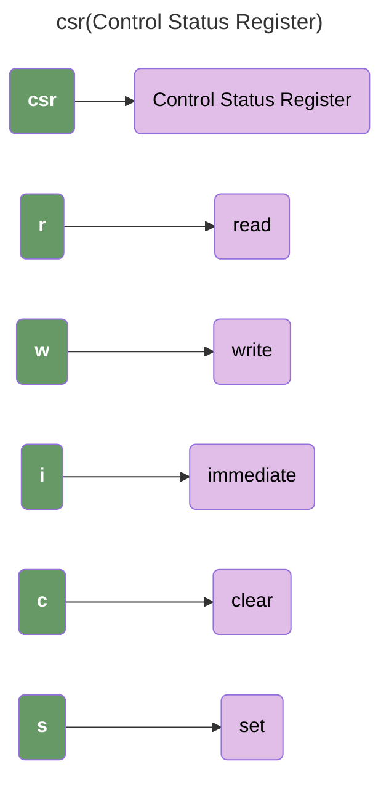
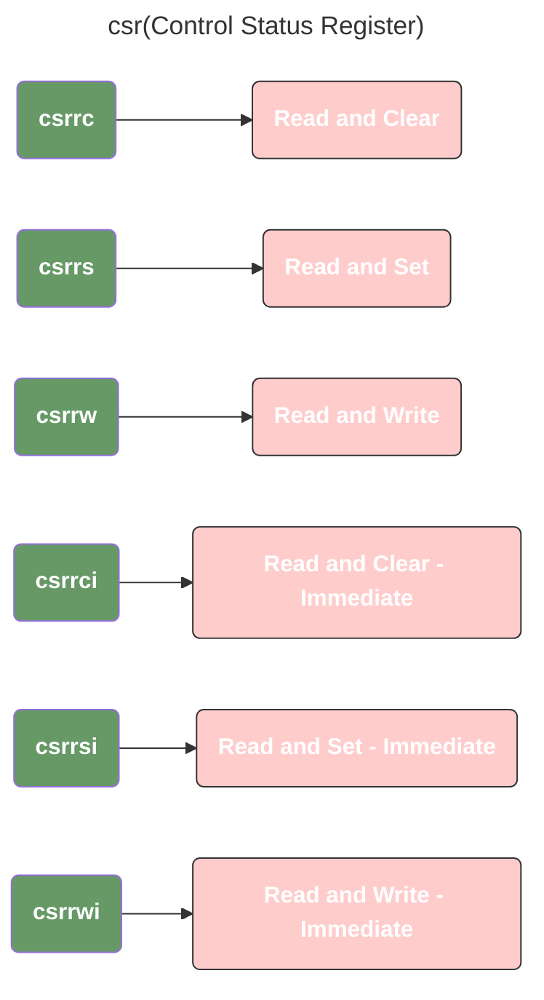

# RV321: RISC-V Base Integer ISA


## RV32I Miscellaneous



### Instructions



## INSERTION SORT

```c
void insertion_sort(long a[], size_t n)
{
  for (size_t i = 1, j; i < n; i++)
  {
    long x = a[i];
    for (j = i; j > 0 && a[j - 1] > x; j--)
    {
      a[j] = a[j - 1];
    }
    a[j] = x;
  }
}
```

