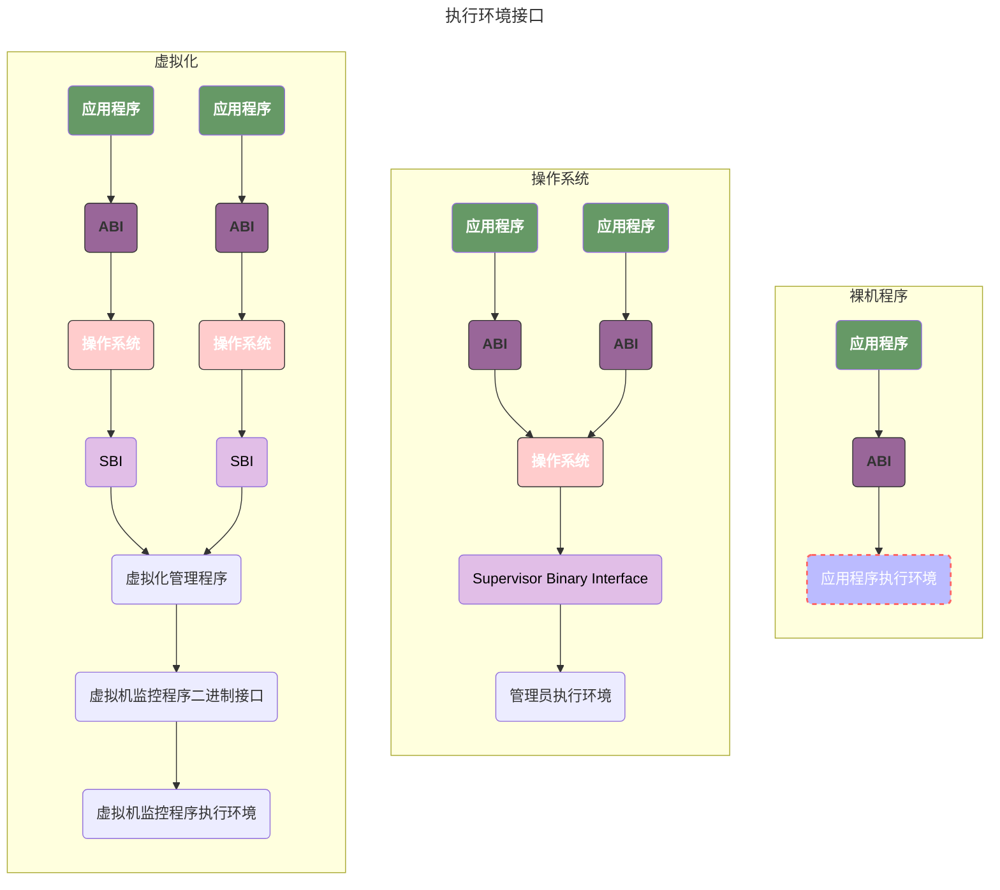
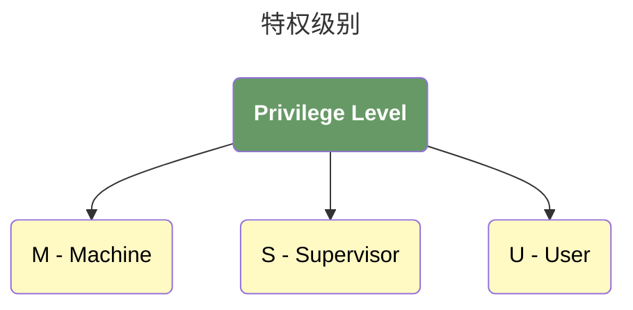

# 第1章 - RISC-V体系结构基础知识

## 基础结构

### 执行环境接口

### 特权级别

### SBI 和 ABI

ABI（Application Binary Interface，应用程序二进制接口）和 SBI（Supervisor Binary Interface，超级用户二进制接口）存在多方面区别，具体如下：

- 定义与作用不同：
  - **ABI**：是一个约定接口，用于规范应用层之间的调用关系，比如函数调用、动态库调用等。它规定了编译器在生成代码时，函数调用时的堆栈保护方式、参数传递所使用的寄存器、返回值使用的寄存器等，保证了二进制应用程序之间的互通性。
  - **SBI**：是 RISC-V 架构特有的，用于规定**低级特权模式向高级特权模式访问的规范**，限定了不同特权模式下对寄存器、某些地址的访问以及对某些中断的操作等，目的是将不同特权完全分隔开，保证系统安全性。
- 适用范围不同：
  - **ABI**：不是 RISC-V 独有的概念，每个架构都有自己的 ABI，虽然具体定义不同，但定义范围大致相似。
  - **SBI**：是 RISC-V 架构独有的，是 RISC-V 针对其特权模式体系（如 M 模式、S 模式）设计的接口标准，其他架构通常没有这个概念。
- 涉及的特权模式层次不同：
  - **ABI**：主要涉及用户模式（U 模式）下应用程序之间或应用程序与动态库之间的交互，规定了应用层软件的二进制接口规范。
  - **SBI**：主要涉及机器模式（M 模式）与监督模式（S 模式）之间的交互，通常是运行在 M 模式的软件为运行在 S 模式的操作系统提供服务，或者 S 模式软件访问 M 模式下的专有资源等。

## RISC-V寄存器

### 通用寄存器

| Register | ABI Name | Description                        | Preserved across call? |
| -------- | -------- | ---------------------------------- | ---------------------- |
| x0       | zero     | Hard-wired zero                    | -                      |
| x1       | ra       | Return address                     | No                     |
| x2       | sp       | Stack Pointer                      | `Yes`                  |
| x3       | gp       | Global Pointer                     | -                      |
| x4       | tp       | Thread Pointer                     | -                      |
| x5       | t0       | Temporaray/alternate link register | No                     |
| x6-x7    | t1-2     | Temporaries                        | No                     |
| x8       | s0/fp    | Saved Register/Frame Pointer       | `Yes`                  |
| x9       | s1       | Saved Register                     | `Yes`                  |
| x10-11   | A0-1     | Function arguments/return values   | No                     |
| x12-17   | a2-a7    | Function Arguments                 | No                     |
| x18-27   | s2-s11   | Saved Register                     | `Yes`                  |
| f0-7     | ft0–7    | FP temporaries                     | No                     |
| f8-f9    | fs0-1    | FP saved registers                 | `Yes`                  |
| f10-11   | fa0-1    | FP arguments/return values         | No                     |
| f12-17   | fa2-7    | FP arguments                       | No                     |
| f18-27   | fs2-11   | FP saved register                  | `Yes`                  |
| f28-31   | ft8-11   | FP temporaries                     | No                     |

### 系统寄存器（Control and Status Register, CSR）

除了通用寄存器之外，还有 **_系统控制_**和**_状态寄存器_**。