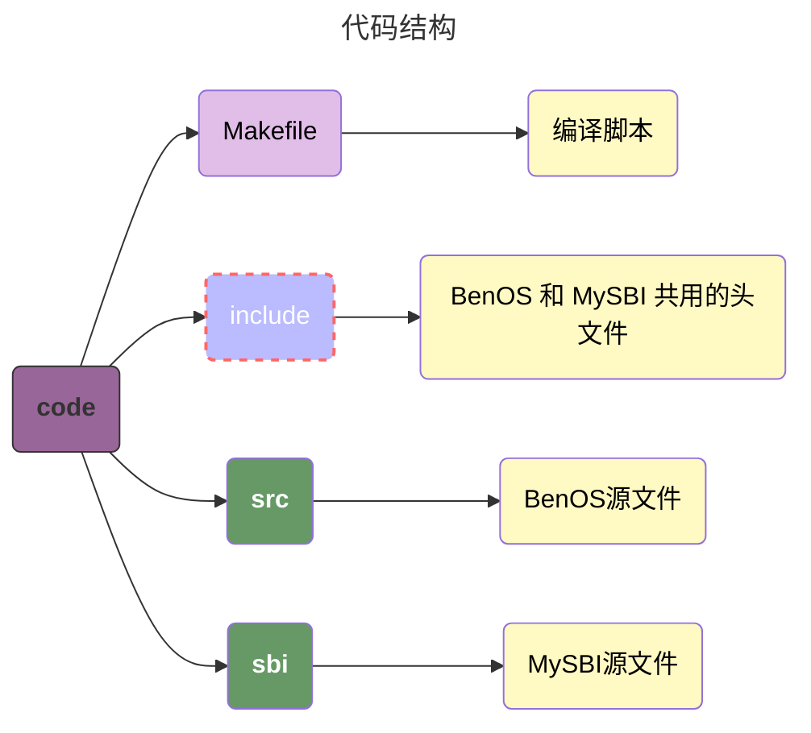
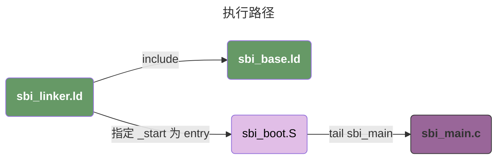

# 02 - 实验平台

## MySBI 和 BenOS 基础实验代码解析

本书大部分代码是基于 `BenOS` 实现的，包含 `MySBI` 和 `BenOS` 两个部分：

-  `MySBI` 是运行在 `M模式` 下的固件，为运行在 `S模式` 下的操作系统提供引导和统一的接口服务。



### 2.3.1 MySBI基础实验代码解析

#### 执行路径




#### 链接脚本（Linker Script, LS）

##### `benos/sbi/sbi_linker.ld`

```less
/* 说明链接脚本对应RISC-V */
OUTPUT_ARCH(riscv)
/* 指定程序入口为 _start */
ENTRY(_start)

/*
 * 描述输出文件的内存布局，SECTIONS 表示如何把输入文件的段映射到输出文件的段。
 * 在这里，我们引入了另外一个linker script
 */
SECTIONS
{
	INCLUDE "sbi/sbi_base.ld"
}
```

`SECTIONS` 用来描述输出文件的内存布局：SECTIONS 命令告诉链接脚本：

1. **如何把输入文件的段映射到输出文件的各个段**
2. **如何将输入段整合为输出段**
3. **如何把输出段放入虚拟存储器地址（Virtual Memory Address, VMA）和加载存储器地址（Load Memory Address, LMA）**

##### `benos/sbi/sbi_base.ld`

这段代码是链接器脚本（Linker Script），不属于传统意义上的编程语言，而是一种用于指导链接器（linker）如何将目标文件组合成可执行文件的脚本语言。

链接器脚本主要用于：

1. 定义程序的内存布局（如代码段、数据段、BSS 段的位置和大小）
2. 指定各段（section）的排列顺序
3. 定义符号（如示例中的`bss_begin`、`bss_end`）以便在代码中引用

下面的代码主要逻辑是：

- `.text.boot` 是一个**自定义的代码段（code section）**，通常用于操作系统内核或嵌入式程序的**启动阶段代码**，是开发者根据需求自定义的段名称（非标准段名）。
- `.text`、`.rodata`、`.data`、`.bss` 是程序的不同段（代码段、只读数据段、数据段、未初始化数据段）
- `ALIGN(0x8)` 表示按 8 字节对齐
- bss_begin = .; 和 bss_end = .; 定义了符号，用于标记 BSS 段的起始和结束位置（. 表示当前地址）
- 如果没有明确声明的情况下，段是连在一起的。例如，在我们的例子中，我们的段按照：`.text.boot -> .text -> .rodata -> .data -> .bss` 的顺序连在一起

```less
    /*
     * 设置sbi的加载入口地址为0x80000000
     *
     */

    /*
     * '.' 代表当前位置计数器（Location Counter, LC
     * 这里把 .text 段的链接地址设置为 0x8000000，其中链接地址指的是加载地址（load address）
     */
	. = 0x80000000,

    /*
     * 其中 *(.text.boot) 可以表示这个文件的 .text.boot 段由所有输入文件的 .text.boot 段组成
     */
	.text.boot : { *(.text.boot) }
	.text : { *(.text) }
	.rodata : { *(.rodata) }
	.data : { *(.data) }

	. = ALIGN(0x8);

	bss_begin = .;
	.bss : { *(.bss*) } 
	bss_end = .;
```

##### `benos/sbi/sbi_boot.S`

这段 RISC-V 汇编代码是一段**启动初始化代码**，主要作用是为后续执行 C 语言代码（`sbi_main`）做准备，主要完成了**栈（stack）的初始化**工作。

```assembly
/*
 * 1. 声明这段代码属于 .text.boot 段（自定义的启动代码段）。
 * 2. 结合之前的链接脚本可知，.text.boot 段会被链接到内存的 0x80000000 地址（RISC-V 处理器的默认启动地址），确保处理器上电后首先执行这段代码。
 */
.section ".text.boot"

/*
 * .globl _start 的主要作用是声明 _start 为一个全局符号（global symbol），作用是初始化一个 4KB 的栈
 */
.globl _start
_start:
	la sp, stacks_start             ; load address  将栈底地址（stacks_start）加载到栈指针寄存器 sp
	li t0, 4096                     ; load imediate 加载立即数 4096 到临时寄存器 t0（栈大小为 4KB）
	add sp, sp, t0                  ; 栈指针 sp = 栈底 + 4096 → 指向栈顶（栈向低地址生长）

	/* goto C */
	tail sbi_main                   ; 无条件跳转到 sbi_main 函数（不保存返回地址，因为不会返回）

.section .data                      ; 声明属于数据段（.data）
.align  12                          ; .align 指定按照 2^12 进行对齐
.global stacks_start                ; 声明 stacks_start 为全局符号，供汇编代码引用
stacks_start:
	.skip 4096
```

##### `sbi_main.c`

```c
#include "asm/csr.h"

#define FW_JUMP_ADDR 0x80200000

/*
 * 运行在M模式
 */
void sbi_main(void)
{
	unsigned long val;

	/* 设置跳转模式为S模式 */
	val = read_csr(mstatus);
	val = INSERT_FIELD(val, MSTATUS_MPP, PRV_S);
	val = INSERT_FIELD(val, MSTATUS_MPIE, 0);
	write_csr(mstatus, val);

	/* 设置M模式的Exception Program Counter，用于mret跳转 */
	write_csr(mepc, FW_JUMP_ADDR);
	/* 设置S模式异常向量表入口*/
	write_csr(stvec, FW_JUMP_ADDR);
	/* 关闭S模式的中断*/
	write_csr(sie, 0);
	/* 关闭S模式的页表转换 */
	write_csr(satp, 0);

	/* 切换到S模式 */
	asm volatile("mret");
}

```

`benos/src/linkder.ld`

```assembly
SECTIONS
{
    /* 设置当前内存地址为 0x80200000 */
	. = 0x80200000,

    /* 指定 .text.boot 自定义段的输入字段 */
	.text.boot : { *(.text.boot) }
	.text : { *(.text) }
	.rodata : { *(.rodata) }
	.data : { *(.data) }
	. = ALIGN(0x8);
	bss_begin = .;
	.bss : { *(.bss*) } 
	bss_end = .;
}
```

