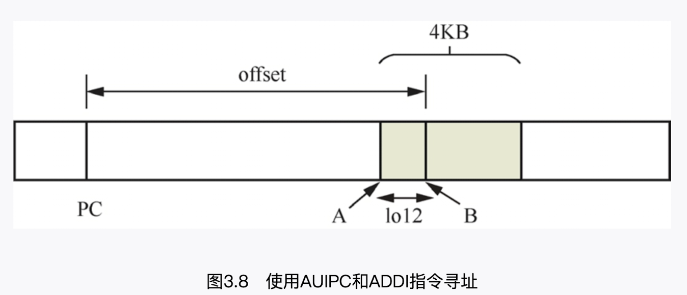
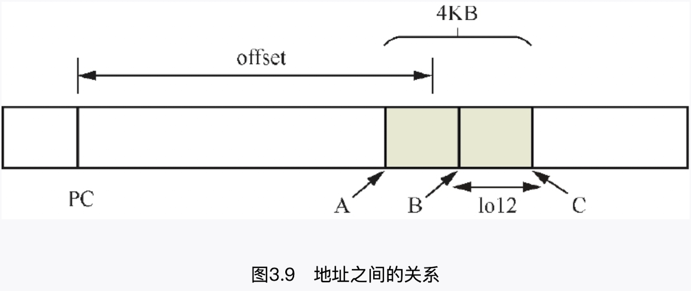
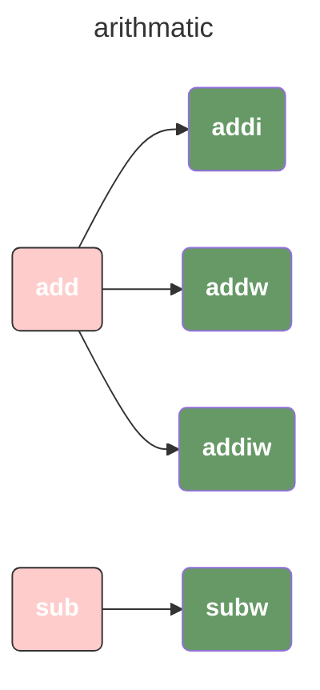
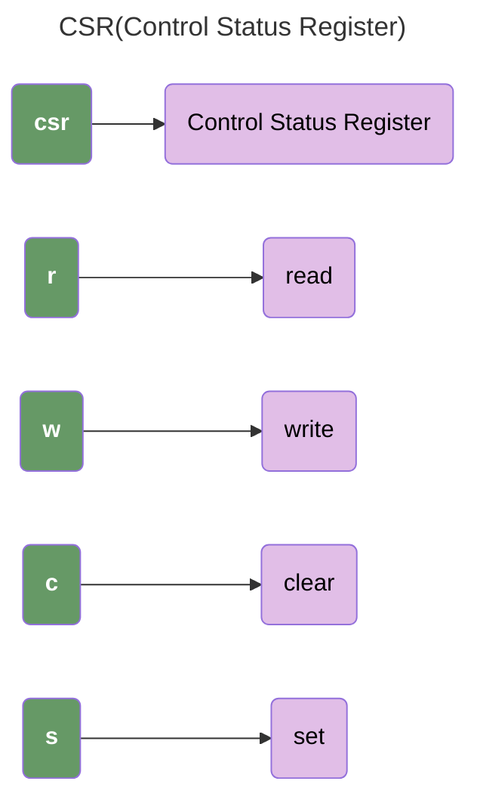

# 03 - 基础指令集

> 为什么寄存器都是**5位**？
>
> 因为riscv有32个寄存器，所以 `2^5` 正好可以表示全部的寄存器。

```mermaid
---
title: RISC-V
config:
    block:
        padding : 10
        font_size : 20
---
block-beta

columns 35
31 30 29 28 27 26 25 24 23 22 21 20 19 18 17 16 15 14 13 12 11 10 9 8 7 6 5 4 3 2 1 0 type["tp"]:3

block:g_1_1:7
    l_1_1("funct7")
end
block:g_1_2:5
    l_1_2("rs2")
end
block:g_1_3:5
    l_1_3("rs1")
end
block:g_1_4:3
    l_1_4("funct3")
end
block:g_1_5:5
    l_1_5("rd")
end
block:g_1_6:7
    l_1_6("opcode")
end
block:g_1_7:3
    l_1_7("R-type")
end

block:g_2_1:12
    l_2_1("[11:0]")
end
block:g_2_2:5
    l_2_2("rs1")
end
block:g_2_3:3
    l_2_3("funct3")
end
block:g_2_4:5
    l_2_4("rd")
end
block:g_2_5:7
    l_2_5("opcode")
end
block:g_2_7:3
    l_2_7("I-type")
end

block:g_3_1:7
    l_3_1("[11:5]")
end
block:g_3_2:5
    l_3_2("rs2")
end
block:g_3_3:5
    l_3_3("rs1")
end
block:g_3_4:3
    l_3_4("funct3")
end
block:g_3_5:5
    l_3_5("[4:0]")
end
block:g_3_6:7
    l_3_6("opcode")
end
block:g_3_7:3
    l_3_7("S-type")
end

block:g_4_1:1
    l_4_1("12")
end
block:g_4_9:6
    l_4_9("[10:5]")
end
block:g_4_2:5
    l_4_2("rs2")
end
block:g_4_3:5
    l_4_3("rs1")
end
block:g_4_4:3
    l_4_4("funct3")
end
block:g_4_5:4
    l_4_5("[4:1]")
end
block:g_4_8:1
    l_4_8("11")
end
block:g_4_6:7
    l_4_6("opcode")
end
block:g_4_7:3
    l_4_7("B-type")
end

block:g_5_1:20
    l_5_1("[31:12]")
end
block:g_5_2:5
    l_5_2("rd")
end
block:g_5_3:7
    l_5_3("opcode")
end
block:g_5_4:3
    l_5_4("U-type")
end

block:g_6_1:1
    l_6_1("20")
end
block:g_6_5:10
    l_6_5("[10:1]")
end
block:g_6_6:1
    l_6_6("11")
end
block:g_6_7:8
    l_6_7("[19:12]")
end
block:g_6_2:5
    l_6_2("rd")
end
block:g_6_3:7
    l_6_3("opcode")
end
block:g_6_4:3
    l_6_4("U-type")
end

classDef pink 1,fill:#FFCCCC,stroke:#333, color: #fff, font-weight:bold;
classDef pale_pink fill:#E1BEE7,color:#000000;
classDef green fill: #696,color: #fff,font-weight: bold;
classDef purple fill:#969,stroke:#333, font-weight: bold;
classDef error fill:#bbf,stroke:#f66,stroke-width:2px,color:#fff,stroke-dasharray: 5 5
classDef coral fill:#f9f,stroke:#333,stroke-width:4px;
classDef animate stroke-dasharray: 9,5,stroke-dashoffset: 900,animation: dash 25s linear infinite;
classDef yellow fill:#FFF9C4,color:#000000;

class l_1_7 green
class l_2_7 green
class l_3_7 green
class l_4_7 green
class l_5_4 green
class l_6_4 green

class l_1_6 error
class l_2_5 error
class l_3_6 error
class l_4_6 error
class l_5_3 error
class l_6_3 error

class l_2_1 yellow
class l_3_1 yellow
class l_3_1 yellow
class l_4_1 yellow
class l_3_5 yellow
class l_4_5 yellow
class l_5_1 yellow
class l_6_1 yellow
class l_4_9 yellow
class l_4_8 yellow
class l_6_5 yellow
class l_6_6 yellow
class l_6_7 yellow

class l_1_1 animate
class l_1_4 animate
class l_2_3 animate
class l_3_4 animate
class l_4_4 animate

class l_1_2 pink
class l_1_3 pink
class l_1_5 pink
class l_2_2 pink
class l_2_4 pink
class l_3_2 pink
class l_3_3 pink
class l_4_2 pink
class l_4_3 pink
class l_5_2 pink
class l_6_2 pink


class 31 green
class 30 green
class 29 green
class 28 green
class 27 green
class 26 green
class 25 green
class 24 green
class 23 green
class 22 green
class 21 green
class 20 green
class 19 green
class 18 green
class 17 green
class 16 green
class 15 green
class 14 green
class 13 green
class 12 green
class 11 green
class 10 green
class 9 green
class 8 green
class 7 green
class 6 green
class 5 green
class 4 green
class 3 green
class 2 green
class 1 green
class 0 green
class type green

```

> RISC-V 指令格式的核心原则：关键字段位置固定，我们观察下图可以看到：
>
> 1. `rs2` 永远在 `[24, 20]`
> 2. `rs1` 永远在 `[19, 15]`
> 3. `rd` 永远在 `[11, 7]`
> 4. `opcode` 永远在 `[6, 0]`
>
> 这意味着，**硬件解码器可以用一套固定逻辑提取这些关键字段，无需根据指令类型重新计算字段偏移，大幅简化了解码电路**



- opcode（操作码）字段：位于指令编码Bit[6:0]，用于指令的分类
- funct3和funct7（功能码）字段：常常与opcode字段结合在一起使用，用来定义指令的操作功能
- `rd`, `rs` 分别表示目标寄存器和源寄存器
- imm 表示立即数

## 3.3 加载与存储指令集

### 加载指令

```assembly
l{d|w|h|b}{u} rd, offset(rs1)
```

| 加载指令           | 位宽 | 描述                                                         |
| ------------------ | ---- | ------------------------------------------------------------ |
| ld rd, offset(rs1) | 8    | 以rs1中的地址作为基址，在偏移offset处加载`1`字节，经过符号扩展后写入rd |
| lh rd, offset(rs1) | 16   | 以rs1中的地址作为基址，在偏移offset处加载`2`字节，经过符号扩展后写入rd |
| lui rd, imm        | 64   | 将立即数imm左移12位，然后进行符号扩展，最后把结果写入rd      |

#### 例3-2

- `符号扩展`是计算机系统把小字节数据转换成大字节数据的规则之一，它将符号位扩展至所需要的位数：**符号扩展中，填充的是原数据的符号位（最高位）**
- `零扩展`按照无符号数处理，因此高字节部分填充为0

```assembly
li t0, 0x8000000				; 伪指令，把立即数加载到t0

lb t1, (t0)							; 以t0寄存器的值为基地址的内存中加载1字节的数据到t1寄存器，并对这1字节的数据进行符号扩展
lb t1, 4(t0)						; 以t0的值为基址的内存在偏移4字节后加载一字节到t1，并对这1字节进行符号扩展
lbu t1, 4(t0)						; 以t0的值为基址的内存在偏移4字节后加载一字节到t1，并对这1字节进行零扩展

lb t1, -4(t0)
ld t1, (t0)
ld t1, 16(t0)
```

#### 例3-3

`lui` 的全称是 `Load Upper Immediate`，作用是加载立即数到目标寄存器的高20位。

```assembly
lui t0, 0x80200
lui t1, 0x40200
```

#### 例-34

在这个例子中，偏移量超过了 `byte` 的取值范围，编译器会报错。

```assembly
lb a1, 2048(a0)
lb a1, -2049(a0)
```

### 存储指令

```assembly
s{d|w|h|b}{u} rs2, offset(rs1)
```

| 加载指令            | 位宽 | 描述                                                |
| ------------------- | ---- | --------------------------------------------------- |
| sb rs2, offset(rs1) | 8    | 把rs2的低8位写入到以rs1为基址的地址偏移offset的位置 |

## 3.4 PC相对寻址

程序计数器(Program Counter, PC)用来指示下一条指令的地址。为了保证CPU正确地执行程序的指令代码，CPU必须知道下一条指令的地址，这就是程序计数器的作用，程序计数器通常是一个寄存器。

### AUIPC

`auipc` 将 `imm` 左移 `12` 位并扩展，**再加上当前PC**后存到寄存器rd：

- 它是有符号的，用于相对偏移
- 左移后的立即数表示的是地址的高20位，所以他的寻址范围基于当前PC的偏移量`±2GB`
- 由于新的立即数低12位是0，所以只能寻址到与4KB对齐的地址，如果需要更细的寻址，需要其他指令的配合（类似于 `ADDI`）

```assembly
# Add Upper Immediate Prgoram Counter
auipc rd, imm
```

### LUI

`lui` 将立即数左移12位，得到一个新的32立即数，再带符号扩展到64位，将其存储到rd寄存器中

```assembly
lui a6, 0x2
```

#### 3-5

```assembly
# PC = 0x8020 0000

auipc a5, 0x2 		# a5 = 0x8020 2000
lui   a6, 0x2 		# a6 = 0x0000 2000
```

### ADDI



`ADDI` 指令可以在 `[−2048, 2047]` 范围内寻址，即被访问地址的低12位。

```c
// 存在一个地址，这个地址是基于原始pc经过auipc和addi两条指令操作后得到的地址
// 假设地址是ptr，pc是原始地址，offset是地址与当前PC值的偏移量
// hi20 和 lo12 的公式

// offset[11] 是为了抵消12位有符号数的影响：
// 在我们的实际寻址过程中，auipc 操作的立即数 imm 实际是表示的 imm << 12 这个值
// 假设auipc的结果是x，addi的操作数是 addi_imm
// 在我们的实际寻址过程中，可能有两种不同的寻址方式
// addi_imm 为正数，由 x 向右偏移得到offset
// addi_imm 为负数，由 x 向左偏移得到offset
// 也就是，当 addi_imm 为负数的时候，auipc 操作的立即数需要额外的跳转4KB
hi20 = (offset >> 12) + offset[11];
lo12 = offset & 0xfff
```

使用AUIPC和ADDI指令对地址B进行寻址。

```assembly
auipc		a0, hi20
addi		a1, a0, lo12
```



在上面这个图中，`offset` 是我们相对于PC的偏移量。地址B为0x8020 1800，地址B正好在4 KB的正中间，地址B与地址A的偏移量为2048字节，与地址C的偏移量为−2048字节

此时，我们的实际 `offset` 可能有两种计算方式：

- `A` + `lo12`
- `C` - `lo12`

但是由于 `A` + `lo12` 计算的话，**lo12 == 2048** 超过了 lo12 的取值范围。

### 与PC相关的加载和存储伪指令

> 计算上述hi20和lo12的过程通常由链接器在重定位时完成：
>
> - PIC表示生成与位置无关的代码(Position Independent Code)
> - GOT表示全局偏移量表(Global Offset Table)
>
> PC相关的加载与存储**伪指令**：
>
> - `la` Load Address 用于加载**任意地址**（全局符号、跨模块符号等），支持所有地址范围。
> - `lla` Load Local Address 仅用于加载**当前编译单元内的局部地址**（如函数内的局部变量、同一模块内的静态符号），地址范围限制在当前链接区域内（通常是 ±2GiB）。
> - 加载
>   - `lb`
>   - `lh`
>   - `lw`
>   - `ld` Load Double 从内存中读取一个 64 位（双字，doubleword）数据到指定寄存器。
> - 存储
>   - `sb`
>   - `sh`
>   - `sw`
>   - `sd` Save Double 将寄存器中的 64 位数据写入内存。
> - `li` Load Immediate 将一个立即数加载到指定寄存器（伪指令，由汇编器转换为实际指令）

| 伪指令                 | 指令组合                                                     | 说明                                                |
| ---------------------- | ------------------------------------------------------------ | --------------------------------------------------- |
| la rd, symbol(NOT PIC) | auipc rd,delta[31:12] + delta[11]<br />addi rd, rd, delta[11:0] | 加载符号的绝对地址<br />其中delta = symbol-pc       |
| la rd, symbol(PIC)     | auipc rd, delta[31:12] + delta[11]<br />l{w \| d} rd, rd, `delta[11:0](rd)` | 加载符号的绝对地址<br />其中delta =GOT[symbol] - pc |
| lla rd, symbol         | auipc rd, delta[31:12] + delta[11]<br />addi rd, rd, delta[11:0] | 加载符号本地地址<br />其中delta = symbole - pc      |

#### 3-7

##### main.c

```c
extern void asm_test(void);

int main(void)
{
        asm_test();

        return 0;
}
```

##### asm.S

```assembly
.globl my_test_data

my_test_data:
        .dword 0x12345678abcdabcd

.global asm_test

asm_test:
        la  t0, my_test_data
        lla t1, my_test_data
        ret
```

##### 编译（关闭PIC）

```bash
gcc main.c asm.S -fno-pic -O2 -g -o test

# 反汇编
objdump -d test
```

##### 反汇编代码

可以看到，在代码中，`la` 和 `lla` 这两条伪指令都被编译为了 `auipc` 和 `addi` 指令。

但是他们 `addi` 操作的目标立即数不一样，因为 `auipc` 是基于PC计算的：在两次执行 `auipc` 指令时，他们的PC是不一样的，也就是说他们跳转到同一个地址的时候偏移量是不一样的。

```assembly
110 00000000000005f4 <my_test_data>:
111  5f4:   abcd                    j       be6 <__FRAME_END__+0x53e>
112  5f6:   abcd                    j       be8 <__FRAME_END__+0x540>
113  5f8:   5678                    lw      a4,108(a2)
114  5fa:   1234                    addi    a3,sp,296
115
116 00000000000005fc <asm_test>:
117  5fc:   00000297                auipc   t0,0x0
118  600:   ff828293                addi    t0,t0,-8 # 5f4 <my_test_data>
119  604:   00000317                auipc   t1,0x0
120  608:   ff030313                addi    t1,t1,-16 # 5f4 <my_test_data>
121  60c:   8082                    ret
```

##### 编译（开启PIC）

```bash
# 编译
gcc main.c asm.S -fpic -O2 -g -o test-pic

# 反汇编
objdump -d test-pic > test-pic.dump
```

##### 反汇编代码（开启PIC）

PIC模式下，LA伪指令是AUIPC和LD指令的集合，它会访问GOT，然后从GOT中获取my_test_data符号的地址；而LLA伪指令是AUIPC和ADDI指令的集合，可直接获取my_test_data符号的绝对地址：

- `la` auipc 计算得到的结果是 `0x263c`，`ld` 读取 `t0` 相对偏移量位置的内存数据到寄存器：
  - 此时 `t0` 的值是 `0x263c`（来自上一步）
  - 偏移量是 `-1548`（十进制），转换为 16 进制为 `-0x60C`（因为 `0x60C = 1548`）
  - 内存访问地址 = `0x263c` + (`-0x60C`) =  `0x2030`
- `lla` 这个开启PIC关闭PIC生成的代码是一样的，因为都是相对地址；

```assembly
0000000000000634 <my_test_data>:
 634:   abcd                    j       c26 <__FRAME_END__+0x53e>
 636:   abcd                    j       c28 <__FRAME_END__+0x540>
 638:   5678                    lw      a4,108(a2)
 63a:   1234                    addi    a3,sp,296

000000000000063c <asm_test>:
 63c:   00002297                auipc   t0,0x2
 640:   9f42b283                ld      t0,-1548(t0) # 2030 <_GLOBAL_OFFSET_TABLLE_+0x10>
 644:   00000317                auipc   t1,0x0
 648:   ff030313                addi    t1,t1,-16 # 634 <my_test_data>
 64c:   8082                    ret
```

##### _GLOBAL_OFFSET_TABLLE_

我们可以注意到，我们最终计算的内存地址为 **0x2030**，然而在我们的反汇编数据中并没有 0x2030 这个地址值。**这是因为，在使用 `-fpic`（生成位置无关代码）编译时，`0x2030` 这类地址是**程序运行时的虚拟地址**，而非静态反汇编中直接可见的 “数据值”—— 静态反汇编只能看到地址的 “符号关联”（如 `_GLOBAL_OFFSET_TABLE_+0x10`）**

我们有一行注释：`# 2030 <_GLOBAL_OFFSET_TABLLE_+0x10>`。这里的 `_GLOBAL_OFFSET_TABLLE_` 表示的是 `全局偏移表（GOT）`。

> 为什么静态反汇编看不到 `0x2030` 的数据？

GOT 有两个关键特性：

1. **数据在运行时填充**：GOT 表项存储的是全局符号（如外部函数、全局变量）的**实际运行时地址**，这个地址由操作系统的动态链接器（如 `ld-linux.so`）在程序启动时计算并填充，静态反汇编（分析编译后的二进制文件）阶段，GOT 表项的初始值通常是 “占位符” 或 “重定位信息”，而非最终运行时数据。
2. **静态反汇编默认不显示数据段细节**：`objdump -d` 仅反汇编**代码段（.text）**，而 GOT 属于**数据段（.got 或 .got.plt）**，静态反汇编代码段时，只会标注 `0x2030` 是 `_GLOBAL_OFFSET_TABLE_+0x10`，不会显示该地址在数据段中存储的内容。

在我们的代码中， 我们想要访问的数据 `my_test_data`，这个数据在 test-pic 中的地址是 0x634，但是在真实的执行的时候，才会按照特定的规则去分配到对应的段中（例如 `.rodata`, `.data`），这里：

- `0x634` **静态二进制文件（test-pic）中的链接地址**（编译链接时确定的 “理论地址”）
- `0x2030` 运行时的地址是操作系统分配的 **虚拟地址**（动态地址）

两者的差异是 `-fpic`（位置无关代码）和动态链接的核心特点：

| 地址类型       | 确定时机     | 作用场景                 | 示例（你的代码）       |
| -------------- | ------------ | ------------------------ | ---------------------- |
| 静态链接地址   | 编译链接阶段 | 二进制文件内部的地址引用 | `my_test_data` = 0x634 |
| 运行时虚拟地址 | 程序加载阶段 | 程序实际执行时的内存地址 | 如 `0x555555556040`    |

`-fpic` 编译的核心是让代码 “不依赖固定地址”，而是通过 **全局偏移表（GOT）** 动态获取符号地址，这个 “重定位规则” 由 **ELF 动态链接标准** 定义，与操作系统（如 Linux）强相关：

1. **静态阶段（编译链接）**：
   编译器不知道 `my_test_data` 的运行时地址，因此在代码中（如 `ld t0, -1548(t0)`）通过 `_GLOBAL_OFFSET_TABLE_`（GOT）间接引用 ——GOT 表项（如 `0x2030`）在静态阶段是 “占位符”，仅记录 “需要关联 `my_test_data`” 的重定位信息（通过 `readelf -r` 可查看）。
2. **运行阶段（加载执行）**：
   操作系统的 **动态链接器（如 `ld-linux.so`）** 会：
   - 加载 `test-pic` 到内存，为其分配一段连续的虚拟地址空间（如 `0x555555554000` 开始）；
   - 解析 GOT 表中的重定位信息，找到 `my_test_data` 在运行时的虚拟地址（如 `0x555555556040`）；
   - 将该地址填入 GOT 表项（如 `0x2030`），最终代码通过 `ld` 指令从 `0x2030` 读取到真实地址，再访问 `my_test_data`。

##### GOT

```assembly
Relocation section '.rela.dyn' at offset 0x438 contains 9 entries:
  Offset          Info           Type           Sym. Value    Sym. Name + Addend
000000001e08  000000000003 R_RISCV_RELATIVE                     59e
000000001e10  000000000003 R_RISCV_RELATIVE                     632
000000001e18  000000000003 R_RISCV_RELATIVE                     5f8
000000002000  000000000003 R_RISCV_RELATIVE                     2000
000000002030  000000000003 R_RISCV_RELATIVE                     634
000000002038  000000000003 R_RISCV_RELATIVE                     560
000000002028  000200000002 R_RISCV_64        0000000000000000 _ITM_deregisterTM[...] + 0
000000002040  000400000002 R_RISCV_64        0000000000000000 __cxa_finalize@GLIBC_2.27 + 0
000000002048  000500000002 R_RISCV_64        0000000000000000 _ITM_registerTMCl[...] + 0

Relocation section '.rela.plt' at offset 0x510 contains 1 entry:
  Offset          Info           Type           Sym. Value    Sym. Name + Addend
000000002018  000300000005 R_RISCV_JUMP_SLOT 0000000000000000 __libc_start_main@GLIBC_2.27 + 0
```

##### 关于GOT的总结

在我们开启PIC编译的情况下，在我们的目标文件中会有两个核心部分：

- 静态链接地址
- GOT表

在我们的这个例子中，我们的数据和GOT表分别如下：

```assembly
0000000000000634 <my_test_data>:
 634:   abcd                    j       c26 <__FRAME_END__+0x53e>
 636:   abcd                    j       c28 <__FRAME_END__+0x540>
 638:   5678                    lw      a4,108(a2)
 63a:   1234                    addi    a3,sp,296
```

```assembly
000000002030  000000000003 R_RISCV_RELATIVE                     634
```

而我们可以看到，在 `GOT` 表中的 `0x2030` 指向了 `634` 这个数据的实际地址，也就是说，如果我们想要访问这个数据，那么我们需要做的是让我们的地址指向 GOT 表的 `0x2030`地址。

#### 3-8

```assembly
.global asm_test
asm_test:
	li t0, 0xffffffff08020000
	ret
```

```bash
gcc main.c li.S -O2 -g -o li
```

```assembly
00000000000005f4 <asm_test>:
 5f4:   72e1                    lui     t0,0xffff8
 5f6:   4012829b                addiw   t0,t0,1025
 5fa:   02c6                    slli    t0,t0,0x11
 5fc:   8082                    ret
```

## 3.5 位移操作

- `sll` (Shift Left Logical)
- `srl`(Shift Right Logical)
- `sra` (Shift Right Arithmatic)

### 3-9

```assembly
li     t0, 0x8000008a00000000			# 0x8000 008A 0000 0000
srai   a1, t0, 1									# a1 = 0xC000 0045 0000 0000
srli   t1, t0, 1									# t1 = 0x4000 0045 0000 0000
```

### 3-10

> 注意， `sraiw` 只处理低32位，所以对于 `0x1 0000 0000` 和 `0x0000 0000` 操作的结果是一样的。

```assembly
li		t0, 0x128000008a			# 0x1280 0000 8a
# staiw 只处理低32位，也就是 0x8000 008a
# 同时，由于是算术右移，并且高位为1，所以高位全部补1
# 0XFFFF FFFF C000 0045
sraiw	a2, t0, 1

# 0x0000 0000 4000 0045
srliw	a3, t0, 1

li 		t0, 0x124000008a			# 0x12 4000 008a
# 虽然是算术右移，但是高位为0，所以高位补0
# 0X2000 0045
sraiw	a4, t0, 1
```

### 3-11

```assembly
li		t0, 0x128000008a			# 0x12 8000 008a
slliw	a3, t0, 1							# 0x0000 0114

li		t0, 0x122000008a			# 0x12 2000 008a
slliw	a4, t0, 1							# 0x4000 0114

li		t0, 0x124000008a			# 0x12 4000 008a
# 这里需要进行符号扩展，左移后的 32 位值是 0x80000114（最高位为 1，负数）
# 根据 slliw 的「符号扩展」规则，高 32 位会填充与低 32 位最高位相同的 1
slliw	a5, t0, 1							# 0xFFFF FFFF 8000 0114
```

## 3.6 位操作指令

- `and`
  - `and`
  - `andi`
- `or`
  - `or`
  - `ori`
- `xor`
  - `xor`
  - `xori`
- `not`

## 3.7 算术指令

> `RV64I` 指令集只提供基础的算术指令，即加法和减法指令。



### 3-12

> `addi` 的指令编码中，`imm` 只占 `12` 位，所以他的取值范围只有 `[-2048, 2047]`
>
> 
>
> **需要注意的是，在编码的时候imm只占12位，但是在代码里我们要把他当做一个32位的立即数，并且这个立即数有一个范围。**

```assembly
addi a1, t0, 0x800									# 非法，因为 0x800 被当做 2048 而不是12位带符号的立即数
addi a1, t0, 0xfffffffffffff800			# 合法
```

### 3-13

```assembly
li		t0, 0x14020000			# t0 = 0x1 4020 0000
li		t1, 0x4000000				# t1 = 0x0 4000 0000

addi	a1, t0, 0x80				# a1 = 0x1 4020 0080
addiw	a2, t0, 0x80				# a2 = 0x0 0020 0080

add		a3, t0, t1					# a3 = 0x1 8020 0000
# 符号扩展
addw	a4, t0, t1					# a4 = 0xFFFF FFFF 8020 0000
```

## 3.9 无条件跳转

- `jal(Jump And Link)` **jal rd, offset** 其中，操作数 `offset[20:1]` 由指令编码的 `Bit[31:12]` 构成，它默认是2的倍数，因此它的跳转范围为当前PC值偏移±1 MB。另外，返回地址(PC + 4)存储到rd寄存器中。根据RISC-V的函数调用规则，如果把返回地址存储到ra寄存器中，则可以实现函数返回。
- `jalr(Jump And Link Register)` **jalr rd, offset(rs1)** 要跳转的地址由rs1寄存器和offset操作数组成。其中，offset是一个12位的有符号立即数

> 关于 `jal` 指令，他分为三个部分：
>
> 1. `20` 位的立即数
> 2. `5` 位的寄存器
> 3. `7` 位的 opcode
>
> 这里存在的一个问题就是，立即数的范围是 `[-524288, 524287]`，为什么我们实际的寻址范围却是 `[-1048576, 1048575]`？
>
> RISC-V 指令地址是**按 2 字节对齐**的（即地址的最低位恒为 0），因此跳转目标地址的最低位必然是 0。基于这一特性，`jal` 指令的立即数在计算实际偏移时会**左移 1 位**，相当于将数值范围扩大 2 倍。

### 3-15

> 假设执行如下各条指令时当前的PC值为0x8020 0000，则下面指令哪些是非法指令？
>
>  `jal a0, 0x800fffff` 这条指令， 目标是跳转到 `0x800fffff` 这个地址，但是实际这个值在真实的编码中并不会体现，因为真实的编码中只有20位（有12位被寄存器编号和opcode占据）。 
>
> 在实际的编码中，这个值存的是offset，而我们看到的  0x800fffff 这个值，是根据offset+PC计算出来的。

```assembly
jal a0, 0x800fffff
jal a0, 0x80300000
```

上述两条指令都超过了JAL指令的跳转范围，JAL指令的跳转范围为[0x8010 0000, 0x802F FFFE]。

在我们的跳转立即数中，本身立即数的范围是 `[0x80000, 0x7FFFF]`，在进行二字节对齐之后范围是 `[0x100000, 0xFFFFE]`，所以最后的范围是 `[0x8010 0000, 0x802F FFFE]`

## 3.10  条件跳转指令

- `beq` **beq rs1, rs2, label1** 如果`rs1`等于`rs2`，则跳转到label处；
- `bne`
- `blt`
- `bltu`
- ` bgt`
- `bgtu`
- `bge`
- `bgeu`

 offset表示label的地址基于当前PC地址的偏移量。操作数offset是13位有符号立即数。其中，offset[12:1]由指令编码的Bit[31:25]以及Bit[11:7]共同构成，offset[0]默认为0, offset默认是2的倍数，它的最大寻址范围是−4 KB～4 KB，因此上述指令只能跳转到当前PC地址±4 KB的范围。若跳转地址大于上述范围，编译器不会报错，因为链接器在链接重定位时会做链接器松弛优化，选择合适的跳转指令。指令编码中的offset值是在链接重定位过程中由当前PC值与label的地址共同确定的。为了方便编程，通常使用汇编符号完成条件跳转指令。

### 3-16

> 在下面的汇编代码中，当x1寄存器与x2寄存器的值不相等时，则跳转到L1标签处。

```assembly
main:
	addi x1, x0, 33
	addi x2, x0, 44
	bne  x1, x2, .L1
	
.L0:
	li   a5, -1
	
.L1:
	mv   a0, a5
	ret
```

## 3.11 CSR(Control and Status Register)

RISC-V体系结构不仅提供了一组系统寄存器，还提供了一组指令来访问这些系统寄存器。

这种模式的寄存器包含了几个主要类型：



### 3-17

```assembly
# 读取 64 位 sscratch 寄存器的旧值，直接写入 64 位 t0 寄存器；与此同时，将 tp 寄存器的当前值写入 sscratch 寄存器，覆盖其原有值。

# 读取：先读取 sscratch 寄存器（CSR 寄存器，用于保存临时数据，常见于中断 / 异常处理）中的当前值；
# 写入：将 tp 寄存器（线程指针寄存器，存放线程相关数据地址）中的值，写入到 sscratch 寄存器中（覆盖其原有值）；
# 回写：将步骤 1 中读取到的 sscratch 旧值，写入到 t0 寄存器中。
csrrw t0, sscratch, tp	# t0 = sscratch, sscratch = tp
csrrw tp, sscratch, tp	# tp = sscratch, sscratch = tp
csrrs t0, sstatus,  t1	# t0 = sstatus, status |= t1
```

## 3.12 寻址范围

1. `长距离寻址`：通过AUIPC指令可以实现基于当前PC偏移量±2 GB范围的寻址，这种寻址方式叫作PC相对寻址，不过AUIPC指令只能寻址到与4 KB对齐的地方。
2. `短距离寻址`：有些指令（如ADDI指令、加载和存储指令等）可以实现基于基地址短距离寻址，即寻址范围为−2048～2047，这个范围正好是4 KB大小内部的寻址范围

## 3.13 陷阱：为什么调用RET指令后进入死循环

在汇编代码里使用CALL指令来调用子函数，但如果处理不当可能会导致程序崩溃。因为使用CALL指令跳转到子函数时会修改ra寄存器（返回地址）的值，把当前PC+4写入ra寄存器中。这就把父函数的返回地址给修改了，导致父函数调用RET指令返回时崩溃，进入死循环。

### asm.S

```assembly
add_test:
	add a0, a0, a1
	nop
	ret
	
.globl branch_test
branch_test:
	li		a0, 1
	li		a1, 2
	/* call function */
	call add_test
	nop
	ret
```

### asm_test

```c
void asm_test(void)
{
  // 调用汇编函数
  branch_test();
}
```

### 分析

1. 假设程序执行到 `branch_test()` 函数时，上一级函数asm_test()的返回地址（ra寄存器的值）为 `0x8020 0160`；
2. 调用子函数add_test()，此时PC值为 `0x8020 0192`；因为ra寄存器的值为调用子函数的CALL指令的PC值加上4。
3. `add_test()` 执行 RET 指令，返回到 `call add_test`，此时ra寄存器的值为0x8020 0196。而对于父函数branch_test()来说，它的返回地址应该为0x8020 0160，这样才能正确返回，而0x8020 0196地址对应branch_test()汇编函数的NOP指令，这样程序就陷入了死循环。

> 整体来说，就是在多个函数层级调用的时候，**每个函数都有自己的 `返回地址` 用于表示父函数的返回地址**。
>
> 我们需要每次调用的时候把ra寄存器保存到临时寄存器。在父函数调用RET指令返回之前，先从临时寄存器中恢复ra寄存器的值，再调用RET指令以返回。
>
> 这里涉及ra寄存器的保存，比较通用的做法是在函数入口把ra寄存器的值都保存到栈中，在函数返回时从栈中恢复ra寄存器的值。
>
> ```assembly
> add_test:
> 	/* 不用保存ra，因为不存在嵌套调用，也就没有人会修改属于本函数的ra的值 */
> 	add a0, a0, a1
> 	nop
> 	ret
> 	
> .globl branch_test
> branch_test:
> 	/* 保存ra到临时寄存器 */
> 	mv 		x18, ra
> 
> 	li		a0, 1
> 	li		a1, 2
> 	/* call function */
> 	call add_test
> 	nop
> 	
> 	mv   ra, x18
> 	ret

